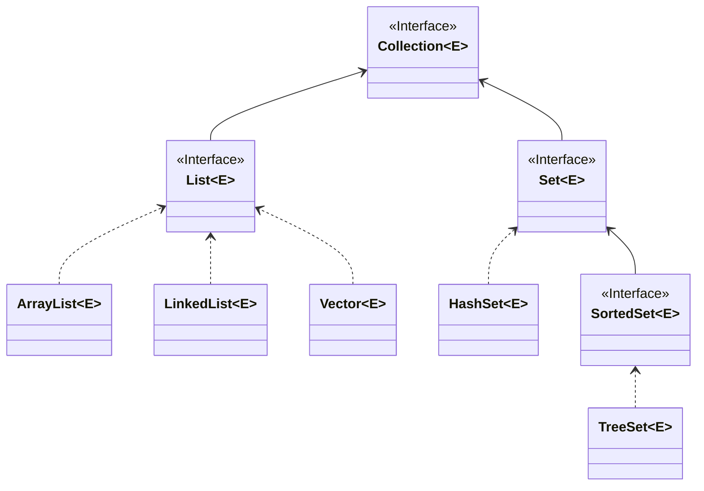

# Java中常见的容器

参考资料：

[Java集合 Collection、Set、Map、泛型 简要笔记(博客园)](https://www.cnblogs.com/coderzjz/p/13587167.html)

[Java集合框架详解 通俗易懂](https://www.bilibili.com/video/BV1zD4y1Q7Fw)

[黑马Java基础教程，零基础快速掌握Java集合框架](https://www.bilibili.com/video/BV1fG4y1g76v)

---

### 常见的容器

| 数据结构                   | 描述                        | 特点和用途                                    |
|------------------------|---------------------------|------------------------------------------|
| **数组（Arrays）**         | 固定大小的容器，可以容纳相同类型的元素。      | 基本的静态数据结构。                               |
| **ArrayList**          | 动态数组，可以根据需要自动增长大小。        | 常用于代替数组，因为它更灵活。                          |
| **LinkedList**         | 双向链表，适用于需要频繁插入和删除操作的情况。   | 高效支持插入和删除操作的数据结构。                        |
| **HashSet**            | 无序集合，不允许重复元素。             | 基于哈希表实现，用于快速查找不重复元素。                     |
| *LinkedHashSet*        | 有序集合，不允许重复元素。             | 保留插入顺序的不重复元素集合。                          |
| *TreeSet*              | 有序集合，不允许重复元素。             | 基于红黑树实现，用于按顺序存储元素。                       |
| **HashMap**            | 无序键值对集合，不允许重复键。           | 基于哈希表实现，用于通过键查找值。                        |
| *LinkedHashMap*        | 有序键值对集合，不允许重复键。           | 保留插入顺序的键值对集合。                            |
| *TreeMap*              | 有序键值对集合，不允许重复键。           | 基于红黑树实现，用于按键排序存储键值对。                     |
| **Stack**              | 基于堆栈（后进先出）的数据结构。          | 通常用于处理栈操作的场景。                            |
| **Queue**              | 用于实现队列（先进先出）的接口。          | 常见实现包括LinkedList和PriorityQueue，用于处理队列操作。 |
| **Deque**              | 双端队列，可以在队列两端进行插入和删除操作。    | LinkedList是一种常见的Deque实现，支持双向插入和删除。       |
| *Vector*               | 与ArrayList类似，但线程安全，不推荐使用。 | 用于多线程环境下的动态数组，现在不常用。                     |
| *Hashtable*            | 与HashMap类似，但线程安全，不推荐使用。   | 用于多线程环境下的哈希表，现在不常用。                      |
| *ConcurrentHashMap*    | 线程安全的哈希表，用于高并发环境。         | 适用于需要高并发性能的多线程应用，用于键值对的存储和访问。            |
| *CopyOnWriteArrayList* | 线程安全的动态数组，适用于读多写少的场景。     | 用于多线程环境下读操作频繁而写操作较少的情况，写操作会复制数据，适合特定用途。  |

